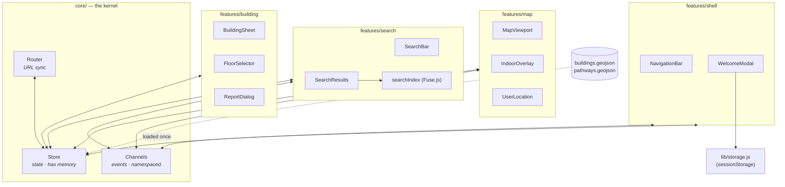
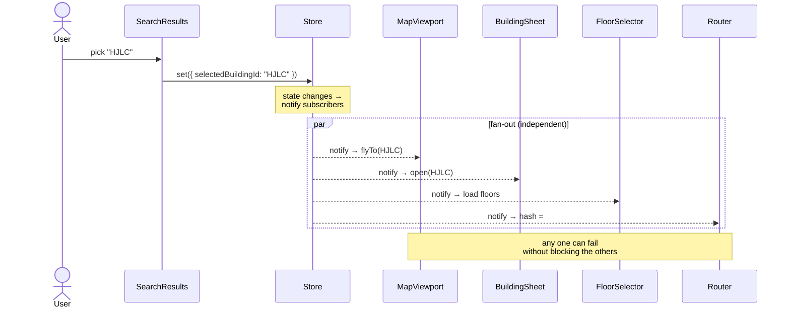

# NMSU Interactive Map — Architecture & UML

A static Progressive Web App. **No server, no build step.** All diagrams below use
Mermaid, which renders natively in the GitHub Wiki and in the GitHub file viewer.

The design principle: **separate durable STATE from transient EVENTS.** A single
"god" event bus has no memory and lets components drift out of sync. Instead a small
three-part **kernel** holds the truth, and every feature plugs into it — so any one
feature can fail in isolation without taking the app down.

---

## 1. The kernel (why not one event bus)

| Part | Job | Has memory? |
|------|-----|-------------|
| **`Store`** | Single source of truth: `selectedBuildingId`, `activeFloor`, `userLocation`, `sheetOpen`. Components subscribe to slices. | ✅ yes |
| **`Channels`** | Transient signals, namespaced by domain (`map:*`, `search:*`, `ui:*`). Fire-and-forget. | ❌ no |
| **`Router`** | Keeps the URL hash in sync with the Store (deep links like `#b/HJLC`). | reads Store |

Rule of thumb: **if you'd ask "what is it *now*?" → Store. If it's "something just
happened" → Channels.**

---

## 2. Repository layout (feature-colocated)

```
nmsu-map/
├── index.html                 # markup shell only
├── manifest.webmanifest       # PWA metadata
├── sw.js                      # service worker — offline caching
├── assets/styles/
│   ├── theme.css              # layout, type, resets, safe-area
│   ├── sheet.css              # drawer transforms + spring curves
│   └── map.css                # marker + pulse-pin styles
├── data/
│   ├── buildings.geojson      # footprints, acronyms, floors, rooms
│   └── pathways.geojson       # sidewalk lines for routing
└── src/
    ├── main.js                # bootstrap: build kernel, mount features
    ├── core/                  # ── THE KERNEL (shared by all) ──
    │   ├── Store.js           # observable single source of truth
    │   ├── Channels.js        # namespaced pub/sub
    │   └── Router.js          # hash <-> state sync
    ├── features/              # ── colocated by domain (GitHub style) ──
    │   ├── map/
    │   │   ├── MapViewport.js
    │   │   ├── IndoorOverlay.js
    │   │   └── UserLocation.js
    │   ├── search/
    │   │   ├── SearchBar.js
    │   │   ├── SearchResults.js
    │   │   └── searchIndex.js
    │   ├── building/
    │   │   ├── BuildingSheet.js
    │   │   ├── FloorSelector.js
    │   │   └── ReportDialog.js
    │   └── shell/
    │       ├── NavigationBar.js
    │       └── WelcomeModal.js
    └── lib/                   # ── dumb, stateless helpers ──
        ├── storage.js         # sessionStorage wrapper (try/catch)
        └── dom.js             # tiny element helpers
```

---

## 3. Component diagram



---

## 4. Class diagram

```mermaid
classDiagram
    direction LR

    class Store {
        -Object state
        -Map subscribers
        +get(key) any
        +set(patch) void
        +subscribe(key, fn) unsubscribe
        -notify(changedKeys) void
    }
    class Channels {
        -Map channels
        +on(channel, evt, fn) unsubscribe
        +emit(channel, evt, payload) void
    }
    class Router {
        +sync(state) void
        +parse() Route
        +onChange(fn) void
    }
    class Kernel {
        +Store store
        +Channels channels
        +Router router
    }
    Kernel *-- Store
    Kernel *-- Channels
    Kernel *-- Router

    class Feature {
        <<interface>>
        +init(kernel) void
        -HTMLElement el
    }

    class MapViewport {
        -maplibregl.Map map
        +init(kernel)
        -onBuildingSelected(id)
        -onFloorChanged(floor)
    }
    class SearchBar {
        -HTMLInputElement input
        +init(kernel)
        -onInput(debounced)
    }
    class SearchResults {
        -SearchIndex index
        +init(kernel)
        -render(matches)
        -choose(id)
    }
    class BuildingSheet {
        -boolean dragging
        +init(kernel)
        -open(building)
        -close()
    }
    class FloorSelector {
        -int[] floors
        +init(kernel)
        -select(floor)
    }
    class IndoorOverlay {
        +init(kernel)
        -draw(buildingId, floor)
        -clear()
    }
    class UserLocation {
        -int watchId
        +init(kernel)
        -onPosition(coords)
    }
    class WelcomeModal {
        +init(kernel)
        -maybeShow()
        -dismiss()
    }

    Feature <|.. MapViewport
    Feature <|.. SearchBar
    Feature <|.. SearchResults
    Feature <|.. BuildingSheet
    Feature <|.. FloorSelector
    Feature <|.. IndoorOverlay
    Feature <|.. UserLocation
    Feature <|.. WelcomeModal

    MapViewport ..> Store : subscribes
    SearchResults ..> Store : sets selectedBuildingId
    BuildingSheet ..> Store : subscribes
    FloorSelector ..> Store : sets activeFloor
    IndoorOverlay ..> Store : subscribes
    UserLocation ..> Store : sets userLocation
    SearchBar ..> Channels : emit search:query
    WelcomeModal ..> storage : sessionStorage
    class storage {
        +get(key) any
        +set(key, val) void
        +has(key) boolean
    }
```

---

## 5. Sequence diagram — selecting a building

The smart part: selection writes **one field of state**; every subscriber reacts on its
own. Works identically whether the trigger is a tap, a search pick, or a shared URL.



---

## 6. The 3-thing connection contract

Know these three facts about a feature and it plugs in cleanly — this *is* its interface.

| Feature | ① Reads (Store slice) | ② Writes / Emits | ③ Depends on |
|---------|----------------------|------------------|--------------|
| **MapViewport** | `selectedBuildingId`, `activeFloor` | writes `selectedBuildingId` on pin tap | MapLibre GL, buildings.geojson |
| **SearchBar** | — | emits `search:query` | debounce helper |
| **SearchResults** | — | writes `selectedBuildingId` | searchIndex (Fuse.js) |
| **BuildingSheet** | `selectedBuildingId` | emits `ui:report-open`; writes `sheetOpen` | buildings.geojson, sheet.css |
| **FloorSelector** | `selectedBuildingId` | writes `activeFloor` | buildings.geojson `floors[]` |
| **IndoorOverlay** | `selectedBuildingId`, `activeFloor` | — (visual only) | map instance, room polygons |
| **UserLocation** | — | writes `userLocation` | `navigator.geolocation` |
| **NavigationBar** | `userLocation` | emits `ui:center`, `ui:welcome` | DOM header |
| **WelcomeModal** | — | writes `visited` | `lib/storage.js` → **sessionStorage** |
| **ReportDialog** | `selectedBuildingId` | opens `mailto:` | buildings.geojson |

---

## 7. Apple-smooth motion budget

Only ever animate `transform` and `opacity` — the two properties the GPU compositor
handles without recalculating layout.

| Interaction | Technique |
|-------------|-----------|
| Map pan / pinch / tilt | MapLibre GL WebGL — `touchZoomRotate`, `touchPitch`, inertial `dragPan`, `maxBounds` = campus |
| Camera to building | `map.flyTo({ curve, speed, essential: true })`, ~500 ms eased |
| Bottom-sheet drag | `translate3d` + `will-change: transform`; release with `cubic-bezier(.32,.72,0,1)` spring |
| Location pulse | CSS keyframes on `scale` + `opacity` only, own layer |
| Search typing | debounce 120 ms before querying Fuse.js |
| Reduced motion | `prefers-reduced-motion` collapses flyTo + spring to instant |

**60 fps litmus test:** if an animation touches `width`, `height`, `top`, or `margin`,
rewrite it as a `transform`.
