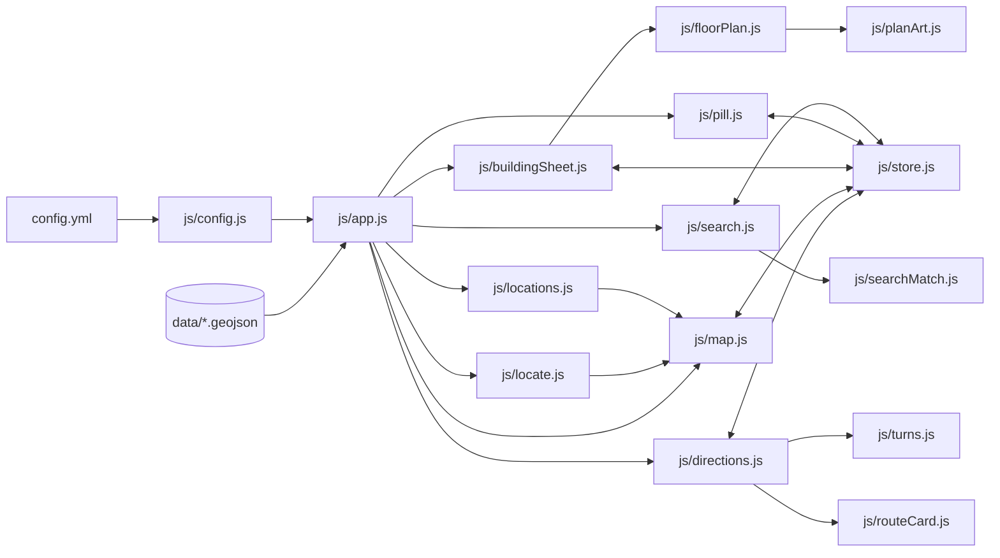

# How Better NMSU Maps is built

A static website: no server, no build step for the app. The browser loads
`index.html`, which loads the libraries and `js/app.js`. Everything else starts
from there.

## The big picture

Three rules keep it predictable:

1. **Every changeable value lives in `config.yml`.** `js/config.js` reads it
   into `CONFIG` (for JavaScript) and turns every value into a CSS variable
   (`pill.height` becomes `--pill-height`) for `styles/app.css`.
2. **The store is the only thing that changes app state.** Files call named
   actions such as `store.selectBuilding(building, 'map')` or `store.closeSheet()`, and
   react to changes with `store.subscribe(fn)`. No file reaches into another
   file's elements.
3. **Heavy data work happens ahead of time, in `tools/`.** The app never does
   geometry math or downloads NMSU records; it reads files that are already done.

## Files

| File | Job |
|---|---|
| `index.html` | All screens, built from Framework7's iOS components |
| `config.yml` | Every colour, size, time and label, grouped by page |
| `styles/app.css` | Look and animation, using only `config.yml` variables |
| `js/app.js` | Start-up: config → Framework7 → data → each feature; menu + welcome |
| `js/config.js` | Loads `config.yml`, fills `CONFIG`, sets CSS variables |
| `js/store.js` | App state + the actions that change it |
| `js/html.js` | Escapes data before it goes into HTML |
| `js/map.js` | The map: campus highlight, building badges, taps |
| `js/buildingSheet.js` | The full-page building sheet |
| `js/pill.js` | The bottom pill (Info / floors) |
| `js/locate.js` | Your location dot (MapLibre's GeolocateControl): on/off, accurate state for the toggle |
| `js/mapSettings.js` | Map settings button left of the pill: My location, Turn map with me, Building names, Back to campus |
| `js/askDirections.js` | Directions button (same spot, when a building is selected) and the "Get directions?" / "Change destination?" questions |
| `js/search.js` | The search drop-down (buildings and rooms) |
| `js/searchMatch.js` | What counts as a match: room numbers, codes, small typos |
| `js/directions.js` | Walking route with blue arrows (Dijkstra shortest path via geojson-path-finder); opens the sheet when you walk in |
| `js/turns.js` | Route -> next turn, distance, time ("590 ft · Turn right onto the path") |
| `js/routeCard.js` | The turn-by-turn card that replaces the pill during directions; tap to list every step, X asks before ending |
| `js/settings.js` | Settings switches (Building names), remembered on this device |
| `js/heading.js` | Compass beam on your location dot, and turning the map with you |
| `js/floorPlan.js` | Plan / posted-map slides (Framework7 Swiper), tap a room to choose it |
| `js/planArt.js` | Draws the chosen room and the indoor arrows onto our plan |
| `js/geo.js` | Distances and point-inside-outline maths |
| `js/locations.js` | The Locations page |

## App state

| Field | Meaning |
|---|---|
| `selectedId` | The chosen building, or `null` |
| `selectedVia` | `'map'` or `'search'`: sets the pause before the sheet opens |
| `sheetWaiting` | The sheet opens once the map has flown to the building |
| `selectedRoom` | The room picked in search (highlighted on its floor plan), or `null` |
| `directionsTo` | `{ buildingId, room }` while directions are on |
| `arrived` | directions brought you inside: the sheet shows "You've arrived" |
| `sheetOpen` | Is the building sheet showing? |
| `activeFloor` | Floor shown in the sheet |
| `searching` | Is search open? |

| Action | What changes |
|---|---|
| `selectBuilding(b, via)` | select `b` on its first floor, end search; the map flies there |
| `selectRoom(b, room, via)` | like `selectBuilding`, on the room's floor |
| `pickRoom(room)` | a room tapped on the plan in the sheet |
| `startDirections()` / `endDirections()` | directions on / off |
| `arrived(b)` | you walked in: directions off, sheet opens on the room's floor |
| `sheetCanOpen(id)` | called by the map after the flight + pause: opens the sheet if still waiting |
| `clearSelection()` | nothing selected, sheet closed, search ended |
| `openSheet()` / `closeSheet()` | sheet open / closed (building stays selected) |
| `showFloor(n)` | show floor `n` |
| `startSearch()` | nothing selected, sheet closed, search open |
| `endSearch()` | search closed |

## Data

| File | Made by | From |
|---|---|---|
| `data/buildings.geojson` | `tools/build_buildings.py` | NMSU Space Planning buildings layer, NMSU Registrar codes, `data/source/photos.json`, `data/source/building-extras.json` |
| `data/campuses.geojson`, `campus-labels.geojson`, `outside-mask.geojson` | `tools/build_campuses.py` | NMSU Space Planning campus boundaries + ground-lease parcels, OpenStreetMap golf course |
| `data/floors/*.svg` | Hand-drawn | Evacuation maps posted in each building |
| `data/rooms.json` | `tools/build_rooms.py` (+ `tools/indoor_routes.py`) | Rooms on our floor plans (with outlines and an indoor route from the nearest outside door / stairs) + rooms in NMSU's public class schedule (Banner; no floor or outline) |
| `data/routes/walk.geojson`, `bike.geojson`, `drive.geojson` | `tools/build_routes.py` | OpenStreetMap paths and roads, sorted by OSM access tags; one-way streets kept for bikes and cars (NMSU publishes no path or road data) |
| `data/entrances.json` | `tools/build_entrances.py` | Outside doors marked on our floor plans; photos listed under `entrancePhotos` in `data/source/building-extras.json` |
| `data/building-shapes.geojson` | `tools/build_buildings.py` | NMSU Space Planning building outlines |
| `data/photos/*.jpg` | Downloaded | Wikimedia Commons (licences in `data/source/photos.json`) |

Which source wins when they disagree:

1. **NMSU Registrar** for building codes (what students see on schedules)
2. **NMSU Office of Space Planning** for boundaries and building facts
3. **OpenStreetMap** only where NMSU publishes nothing (golf course outline, Corbett's floor count)

`data/source/paths.geojson` and `entrances.geojson` are the walking network
and doors from OpenStreetMap, kept for the wayfinding feature that isn't built yet.

## Things that look odd but are on purpose

- **Badges are drawn by the map, not as HTML markers.** HTML markers lag while dragging.
- **The sheet waits for the map.** Picking a building flies the map there first, pauses
  (`map.sheetPauseAfterTap` / `sheetPauseAfterSearch`), then opens the sheet, so you see where it is.
- **Every sheet has the same layout** (in `index.html`); empty fields show a message.
  `tools/build_buildings.py` gives every building the same fields.
- **Indoor arrows come from our plans, not GPS.** Phones can't tell which room or floor you're in, so arrival is detected at the building (NMSU's outline); the plan then shows arrows from the nearest outside door (floor 1) or stairs (upper floors) through open floor to the room's edge. Room doors aren't on the posted maps, so arrows stop at the room.
- **Some rooms have no highlight.** Rooms from the class schedule have no published floor or outline, so the app goes to the building and says so.
- **The pill sits outside `#app`** with a high `z-index` so it floats above Framework7's sheet.
- **The page stays hidden until `config.yml` loads**, so nothing flashes unstyled.
- **Leased NMSU land is cut out of the campus shapes** (not painted over), so
  the real map shows through.
