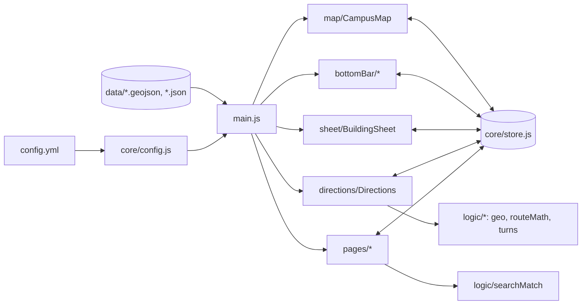

# How Better NMSU Maps is built

A static website: no server, no build step. The browser loads `index.html`,
which loads the libraries, the stylesheets in `styles/`, and **`js/main.js`**.
`main.js` starts everything, in order, so it's the best file to read first.

## The big picture

Four rules keep it predictable:

1. **Every changeable value lives in `config.yml`.** `js/core/config.js` reads it
   into `CONFIG` (for JavaScript) and turns every value into a CSS variable
   (`pill.height` becomes `--pill-height`) for the stylesheets.
2. **The store is the only thing that changes app state** (a *single source of truth*).
   Files call named actions such as `store.selectBuilding(building, 'map')` and
   react to changes with `store.subscribe(listener)` (the *observer* pattern).
   No file reaches into another file's elements.
3. **Each part is a class that gets what it needs through its constructor**
   (*dependency injection*): `new MapFiltersButton(campusMap)`. `main.js` is the
   only place that creates them, so you can see every connection in one file.
4. **Maths and data work are kept apart from the page.**
   `js/logic/` has no page or map code at all, and the heavy work (downloading
   NMSU records, shape maths) happens ahead of time in `tools/`.

## Folders

| Folder | What's in it | Who owns it |
|---|---|---|
| `js/core/` | Shared tools: settings, app state, saving choices, safe HTML | Technical Lead |
| `js/logic/` | Pure maths and text, no page code: distances, shapes, search matching, turn words, route maths | QA / fact checker (easiest to review and test) |
| `js/map/` | The map, its badges and campus shapes, your location, the compass | Map / UI |
| `js/bottomBar/` | The pill and the round buttons at the bottom | Map / UI |
| `js/directions/` | Loading route data, drawing the route, the turn-by-turn card | Technical Lead + Map / UI |
| `js/sheet/` | The building sheet: floor plans, photos, the picture viewer | Design & QA |
| `js/pages/` | Menu, search, Locations, Settings, welcome screen, navbar title | Design & QA |
| `styles/` | One stylesheet per part of the screen | Design & QA |
| `tools/` | Python scripts that build `data/` from official sources | Campus Data |
| `data/source/` | The inputs those scripts read (hand-checked extras, photos, parks) | Campus Data |

## Files

| File | Job |
|---|---|
| `index.html` | Every screen, built from Framework7's iOS components |
| `config.yml` | Every colour, size, time and label, grouped by part |
| `js/main.js` | Start-up: config → Framework7 → data → every part, in order |
| **core** | |
| `js/core/config.js` | Loads `config.yml`, fills `CONFIG`, sets the CSS variables |
| `js/core/store.js` | `Store` class: the app state and the actions that change it |
| `js/core/storage.js` | Remembering choices on this device (safe when storage is blocked) |
| `js/core/html.js` | Escapes data before it goes into HTML; icon HTML |
| `js/core/offline.js` | Turns on the service worker (`sw.js`) |
| `sw.js` | Service worker: keeps the app, data, libraries and seen map tiles on the phone (Workbox), so repeat opens load in milliseconds and work offline |
| **logic** | |
| `js/logic/shapes.js` | Point inside a polygon, polygon area, box around points |
| `js/logic/geo.js` | Distances in metres, "am I inside this building?" |
| `js/logic/searchMatch.js` | What counts as a search match: room numbers, codes, small typos |
| `js/logic/turns.js` | A route → the next turn, distances, time ("590 ft · Turn right onto the path") |
| `js/logic/routeMath.js` | Segment costs, nearest network point, where a route starts and ends |
| **map** | |
| `js/map/campusMap.js` | `CampusMap`: creates the map, flies to the chosen place, handles taps |
| `js/map/campusLayers.js` | Draws NMSU's class places (tint, outline, names) |
| `js/map/badges.js` | The "i" badges and names, and the MapLibre rules that colour them |
| `js/map/myLocation.js` | `MyLocation`: your blue dot (MapLibre's GeolocateControl) |
| `js/map/compass.js` | `Compass`: the facing beam, and "Turn map with me" |
| `js/map/northCompass.js` | `NorthCompass`: the small compass top left (Map settings > Compass, off at first); tap = Home |
| `js/map/parkingLayers.js` | Parking lot shapes and names, downloaded the first time the Parking filter is switched on |
| **bottomBar** | |
| `js/bottomBar/bottomPill.js` | `BottomPill`: "Tap a building" / "Info" / "Floor 1", and the floor stack |
| `js/bottomBar/mapSettingsButton.js` | `MapSettingsButton`: My location, Turn map with me, Building names, Compass, Home |
| `js/bottomBar/mapFiltersButton.js` | `MapFiltersButton`: show or hide Study / Housing / Parks / Food (on at first) and Staff Academic / Historic / Parking (off at first); the first category is the bottom row |
| `js/bottomBar/directionsButton.js` | `DirectionsButton`: the "Get directions?" / "Change destination?" questions |
| **directions** | |
| `js/directions/directions.js` | `Directions`: follows GPS, finds the route (Dijkstra via geojson-path-finder), detects arriving |
| `js/directions/routeData.js` | `RouteData`: loads the routing library, outlines and path networks once |
| `js/directions/routeDrawing.js` | Draws the blue line, arrows and dotted hops on the map |
| `js/directions/routeCard.js` | `RouteCard`: the turn-by-turn card; tap for every step, X asks before ending |
| **sheet** | |
| `js/sheet/buildingSheet.js` | `BuildingSheet`: fills in the sheet, opens and closes it |
| `js/sheet/floorPlan.js` | `FloorPlan`: plan / posted-map slides, tapping rooms and entrances |
| `js/sheet/planPicture.js` | Draws the chosen room, indoor arrows and entrances onto our plan |
| `js/sheet/photoViewer.js` | `PhotoViewer`: full-screen pictures with pinch-zoom |
| **pages** | |
| `js/pages/search.js` | `Search`: the search drop-down (rooms, then buildings) |
| `js/pages/menu.js` | `Menu`: the full-screen menu, opens Locations, Other Locations and Settings |
| `js/pages/locations.js` | `LocationsPage`: every place on our map you can go to, grouped by category |
| `js/pages/otherLocations.js` | `OtherLocationsPage`: every NMSU property (campuses and sites), nearest first |
| `js/pages/settings.js` | `SettingsPage`: choices, Map filters rows, Reset, the Data list |
| `js/pages/welcome.js` | The welcome screen, once per browser tab |
| `js/pages/navbarTitle.js` | "Campus", or "To Zuhl Library" during directions |
| **styles** (loaded in this order) | |
| `styles/base.css` | Framework7 colours, spacing scale, page layouts, navbars, squircle corners |
| `styles/map.css` | The map, the facing beam |
| `styles/search.css` | The search drop-down |
| `styles/bottomBar.css` | The pill, floor stack, round buttons and their options |
| `styles/routeCard.css` | The turn-by-turn card |
| `styles/menu.css` | The menu |
| `styles/sheet.css` | The building sheet |
| `styles/pages.css` | Welcome screen and Settings page |

A **class** is used when a part remembers things between taps (a button that is
open or closed, a sheet showing a building). A plain **function** is used when
something only needs setting up once (`showWelcome`) or just calculates an
answer (everything in `js/logic/`).

## App state (`js/core/store.js`)

| Field | Meaning |
|---|---|
| `selectedId` | The chosen building or park, or `null` |
| `selectedVia` | `'map'` or `'search'`: sets the pause before the sheet opens |
| `sheetWaiting` | The sheet opens once the map has flown to the building |
| `sheetOpen` | Is the building sheet showing? |
| `activeFloor` | The floor shown in the sheet |
| `selectedRoom` | The chosen room (highlighted on its floor plan), or `null` |
| `directionsTo` | `{ buildingId, room }` while directions are on |
| `arrived` | Directions brought you inside: the sheet shows "You've arrived" |
| `travelMode` | `'walk'`, `'bike'` or `'drive'` |
| `showNames` | Building names on the map |
| `showCompass` | The small compass top left |
| `units` | `'imperial'` (ft, mi) or `'metric'` (m, km) |
| `hiddenCategories` | Map filters that are switched off |
| `filterOptions` | Which categories have a row in the Map filters button (Settings > Map filters) |
| `searching` | Is search open? |

| Action | What changes |
|---|---|
| `selectBuilding(b, via)` | choose `b` on its first floor, end search; the map flies there |
| `selectRoom(b, room, via)` | like `selectBuilding`, on the room's floor |
| `pickRoom(room)` | a room tapped on the plan in the sheet |
| `sheetCanOpen(id)` | called by the map after the flight and pause: opens the sheet if still waiting |
| `clearSelection()` | nothing chosen, sheet closed, search ended |
| `openSheet()` / `closeSheet()` | sheet open / closed (the building stays chosen) |
| `showFloor(n)` | show floor `n` |
| `startSearch()` / `endSearch()` | search open (nothing chosen) / closed |
| `startDirections()` / `endDirections()` | directions on / off |
| `arrived(b)` | you walked in: directions off, the sheet opens on the room's floor |
| `setTravelMode(m)`, `setShowNames(on)`, `setShowCompass(on)`, `setUnits(u)` | the user's choices |
| `toggleCategory(c)`, `setHiddenCategories(list)` | Map filters |
| `setFilterOption(c, inButton, max)`, `setFilterOptions(list)` | Settings > Map filters: up to 6 rows; switching one on shows that category, off hides it |

## Data structures and algorithms you'll find

| Where | What | Why |
|---|---|---|
| `js/core/store.js` | Observer pattern (a list of listener functions) | Every part updates itself when the state changes |
| `js/logic/routeMath.js`, `js/directions/routeData.js` | A graph of paths; Dijkstra's shortest path (geojson-path-finder) | The shortest walk, bike ride or drive |
| `js/logic/routeMath.js` | `Map` from "point|point" to street names | Naming the street of every turn |
| `js/logic/searchMatch.js` | Levenshtein distance (a dynamic-programming table) | Finding "Hardman" when you type "harmon" |
| `js/logic/shapes.js` | Ray casting, the shoelace formula | Tapping a room; "am I inside?" |
| `tools/indoor_routes.py` | A grid, breadth-first search, Dijkstra with a priority queue (`heapq`) | Arrows from the door to a room |
| `tools/build_routes.py` | Union-find (disjoint sets) | Keeping only paths that connect |

## Data

Every data file starts with a `"//"` entry: what the file is and how to format it.
(JSON has no comments, so this is the stand-in; the scripts and the app skip it.)

| File | Made by | From |
|---|---|---|
| `data/buildings.geojson`, `building-shapes.geojson`, `descriptions.json` | `tools/build_buildings.py` | NMSU Space Planning buildings layer, NMSU Registrar codes, `data/source/photos.json`, `data/source/building-extras.json` |
| `data/campuses.geojson`, `campus-labels.geojson`, `outside-mask.geojson` | `tools/build_campuses.py` | NMSU Space Planning campus boundaries + ground-lease parcels, OpenStreetMap golf course |
| `data/places.geojson`, `place-shapes.geojson`, `parking-lots.geojson` | `tools/build_places.py` | Places that aren't buildings: parks (NMSU's campus map), food with its hours (NMSU Dining), and parking lots (NMSU Facilities GIS Parking layer, plus OpenStreetMap parking at NMSU properties that layer misses) |
| `data/rooms.json` | `tools/build_rooms.py` (+ `tools/indoor_routes.py`) | Rooms on our floor plans (outlines + indoor routes) and rooms in NMSU's public class schedule (no floor or outline) |
| `data/entrances.json` | `tools/build_entrances.py` | Outside doors on our floor plans; photos under `entrancePhotos` in `data/source/building-extras.json` |
| `data/routes/walk.geojson`, `bike.geojson`, `drive.geojson` | `tools/build_routes.py` | OpenStreetMap paths and roads, sorted by their access tags; one-way streets kept for bikes and cars |
| `data/floors/*.svg` | Hand-drawn | Evacuation maps posted in each building. Each plan has a compass, turned to match NMSU Space Planning's outline of that building (checked against the compass on the posted map) |
| `data/photos/*.jpg` | Downloaded | Wikimedia Commons (licences in `data/source/photos.json`) |
| `tools/json_files.py` | — | Writes every data file with its `"//"` note first |

Which source wins when they disagree:

1. **NMSU Registrar** for building codes (what students see on schedules)
2. **NMSU Office of Space Planning** for boundaries and building facts
3. **OpenStreetMap** only where NMSU publishes nothing (golf course outline, some floor counts)

## Speed

- **The first screen loads first.** `main.js` downloads only the buildings and campus shapes, starts
  Framework7 while they're on their way, and creates the map. Everything else (places, rooms, doors,
  descriptions) loads straight afterwards and is handed to the parts that use it, so the map appears sooner.
- **Work is done when it's needed, not at start-up:** each badge picture is drawn the first time its
  kind of place is shown, the Locations and Settings pages are built the first time they're opened,
  search works out its word list on first use, and the parking outlines download when Parking is switched on.
- **The service worker (`sw.js`)** answers from the copy saved on the phone after the first visit:
  in testing, every app file and data file came back in about 2–17 ms with nothing downloaded.
  It refreshes that copy quietly in the background, so **a change shows up the second time the app
  is opened** (or after a refresh). While editing on your computer, turn on "Update on reload" in the
  browser's developer tools (Application > Service Workers) to always see your latest edit.
- **Big files load only when needed:** route networks and outlines when directions start, parking
  lot outlines when the Parking filter is first switched on.

## Things that look odd but are on purpose

- **Badges are drawn by the map, not as HTML markers.** HTML markers lag while dragging.
- **The sheet waits for the map.** Choosing a building flies the map there first, pauses
  (`map.sheetPauseAfterTap` / `sheetPauseAfterSearch`), then opens the sheet, so you see where it is.
- **Every sheet has the same layout** (in `index.html`); empty parts show a message.
  `tools/build_buildings.py` gives every building the same fields.
- **Indoor arrows come from our plans, not GPS.** Phones can't tell which room or floor you're in,
  so arrival is detected at the building (NMSU's outline); the plan then shows arrows from the
  nearest outside door (floor 1) or stairs (upper floors) to the room's edge.
- **Some rooms have no highlight.** Rooms from the class schedule have no published floor or outline.
- **The bottom bar sits outside `#app`** with a high `z-index` so it floats above Framework7's sheet.
- **The page stays hidden until `config.yml` loads**, so nothing flashes unstyled.
- **Leased NMSU land is cut out of the campus shapes** (not painted over), so the real map shows through.
- **The order parts are created in `main.js` matters.** Each part starts listening to the store
  when it's created, and they update in that order.
